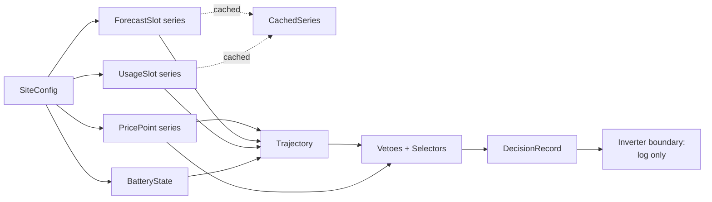

# Phase 1 Data Model: Price-Aware Load Automation

**Mission**: `price-aware-load-automation-01M3PH8Y`
**Date**: 2026-09-29

All structures below are plain Python data passed between pure functions. Nothing here is a database schema, an ORM model, or a Home Assistant entity — the core holds no persistent objects and owns no I/O. Field types are Python types; units are stated because getting them wrong is the likeliest source of silent error in this mission.

---

## SiteConfig

Loaded once per cycle from `battery_planner/user_config.yaml` by the adapter, passed into the core. Never mutated by the core.

| Field | Type | Unit | Default | Notes |
|---|---|---|---|---|
| `consumption_multiplier` | float | — | 1.07 | FR-001 |
| `consumption_offset` | float | EUR/kWh | 0.007 | FR-001 |
| `injection_multiplier` | float | — | 0.94 | FR-002 |
| `injection_offset` | float | EUR/kWh | −0.011 | FR-002; negative offset is why V2 is load-bearing |
| `capacity_kwh` | float | kWh | *required* | FR-006 |
| `reserve_percent` | float | % | 10.0 | FR-010 |
| `max_charge_kw` | float | kW | 5.0 | Binding constraint per block, independent of capacity |
| `max_discharge_kw` | float | kW | 5.0 | |
| `round_trip_efficiency` | float | fraction | 0.90 | FR-016; also gates S2 |
| `block_minutes` | int | minutes | 15 | FR-029 |
| `evaluation_interval_minutes` | int | minutes | 5 | NFR-001 |
| `forecast_retry_minutes` | int | minutes | 10 | FR-024 |
| `solar_cache_stale_minutes` | int | minutes | 120 | FR-036 — twice the refresh interval |
| `usage_cache_stale_minutes` | int | minutes | 2880 | FR-036 — twice the daily rebuild |
| `alert_address` | str | — | *required* | FR-021 |
| `realert_minutes` | int | minutes | 60 | FR-022, NFR-003 |
| `timezone` | str | — | `Europe/Brussels` | C-008 |
| `capacity_enabled` | bool | — | true | FR-053 |
| `billing_floor_kw` | float | kW | 2.5 | C-013 — no saving below it |
| `guard_interval_seconds` | int | seconds | 30 | NFR-010 |
| `usage_history_weeks` | int | weeks | 4 | Trailing window for the usage profile (>= 1) (FR-005) |
| `usage_recency_weighting` | str | — | `linear` | `linear` \| `none`. `linear` weights each date by `usage_history_weeks` minus its week index (0 = the most recent 7 days), so with four weeks the weights are 4, 3, 2, 1; `none` is a plain mean. Part of the cache fingerprint |
| `usage_grouping` | str | — | `same_weekday` | `same_weekday` \| `day_type` (FR-059). Part of the cache fingerprint: changing it invalidates the cached usage profile |
| `quarter_hour_average_mode` | str | — | `auto` | FR-055, FR-057 — `auto` \| `running` \| `accumulating` |
| `offtake_sensor` | str | — | `sensor.slimmelezer_power_consumed` | C-012 — the **netted** total, never a per-phase sum |

**Validation**: `capacity_kwh > 0`; `0 ≤ reserve_percent < 100`; `0 < round_trip_efficiency ≤ 1`; `block_minutes` divides 60. A failed validation is a startup error, not a degraded cycle — bad configuration must not silently produce plausible-looking decisions.

---

## PricePoint

One block's prices. Produced by `prices.py` from the ENTSO-e series.

| Field | Type | Unit | Notes |
|---|---|---|---|
| `block_start` | datetime | — | Timezone-aware, local |
| `market_price` | float | EUR/kWh | As published |
| `consumption_price` | float | EUR/kWh | `market × consumption_multiplier + consumption_offset` |
| `injection_price` | float | EUR/kWh | `market × injection_multiplier + injection_offset` |
| `source_resolution_minutes` | int | minutes | 60 when held flat from hourly data (FR-030) |

**Series alignment (FR-039, FR-040)**: the price series is a **mapping keyed by `block_start`**, not a positional list. Solar and usage series are dense and contiguous from now to `horizon_end`; the price map may have holes where the market published nothing. Every join between the three is by block start time.

A block absent from the price map is still projected by the trajectory — the battery charges and discharges whether or not a price exists — but is **not eligible** as an export or import window, because no price can be compared. Selectors searching for the best or cheapest block iterate only blocks present in the map.

**Invariant**: the two derived prices are computed independently and never assumed symmetric. With the default coefficients, `injection_price < 0` whenever `market_price < 0.0117`, while `consumption_price < 0` only below `−0.00654` — the ~1.8 c/kWh band where V2 is the only protection against a loss-making export.

---

## ForecastSlot

| Field | Type | Unit | Notes |
|---|---|---|---|
| `block_start` | datetime | — | |
| `expected_kwh` | float | kWh | Energy in this block, not power |
| `is_zero_fallback` | bool | — | True when the forecast was unavailable (FR-023) |
| `source_resolution_minutes` | int | minutes | Held flat across sub-blocks (FR-030) |

---

## UsageSlot

| Field | Type | Unit | Notes |
|---|---|---|---|
| `block_start` | datetime | — | |
| `expected_kwh` | float | kWh | Recency-weighted mean (`usage_recency_weighting`) over the configured window for this block, grouped by `usage_grouping` (same weekday, or day type) |
| `sample_days` | int | days | Distinct dates that contributed to this slot (a plain count, unaffected by recency weights): up to `usage_history_weeks` under same-weekday grouping, up to about 5x that under day-type grouping. A genuine sample count, so it now does signal thin history; the adapter still reports overall coverage separately (FR-005, FR-059) |

### Usage history source

`read_usage_history` returns `[(aware block_start, load_kwh)]`, oldest first, read from the planner's own energy-history files (`battery_planner/history/blocks-YYYY-MM-DD.jsonl`, one JSON object per 15-minute block, written by `pyscript/modules/history.py`; see the README section "Energy history"). Only blocks whose `load_kwh` is known are returned, so the list is empty (and V4 keeps grid charging off) until a `load` counter, or a `solar` counter together with both battery counters, is configured. Other recorded fields (`import_kwh`, `export_kwh`, `solar_kwh`, the load split, `forecast_solar_kwh`, prices, `complete`, read times) are for later analysis and feed no decision yet.

---

## BatteryState

| Field | Type | Unit | Notes |
|---|---|---|---|
| `charge_percent` | float | % | **Stubbed this mission** (FR-007, C-003) |
| `stored_kwh` | float | kWh | `capacity_kwh × charge_percent / 100` (FR-006) |
| `usable_kwh` | float | kWh | `stored_kwh − capacity_kwh × reserve_percent / 100`, floored at 0 |
| `headroom_kwh` | float | kWh | `capacity_kwh − stored_kwh` |
| `is_stubbed` | bool | — | Always True this mission; surfaces in the record (FR-027) |

---

## TrajectoryBlock

One step of the projection. The heart of the mission.

| Field | Type | Unit | Notes |
|---|---|---|---|
| `block_start` | datetime | — | |
| `solar_kwh` | float | kWh | From ForecastSlot |
| `usage_kwh` | float | kWh | From UsageSlot |
| `absorbed_kwh` | float | kWh | Solar actually stored — limited by headroom **and** `max_charge_kw × block` |
| `spilled_kwh` | float | kWh | `max(0, solar − usage − absorbed)` — reaches the grid regardless. Computed **every block**, not only after saturation: the charge-power ceiling can force spill while headroom remains |
| `has_price` | bool | — | False where the market published no price for this block (FR-040); the block is still projected but cannot be chosen as a window |
| `projected_charge_kwh` | float | kWh | End-of-block charge, clamped to `[reserve, capacity]` |
| `projected_percent` | float | % | |

**Invariant**: `spilled_kwh > 0` is possible while `headroom_kwh > 0`, because charge *power* binds independently of capacity. Clamping must report the difference as spill rather than discarding it — energy that vanishes from the projection is a bug that makes the planner look better than it is.

---

## Trajectory

| Field | Type | Unit | Notes |
|---|---|---|---|
| `blocks` | list[TrajectoryBlock] | — | ~140 for a 35-hour horizon |
| `saturation_block` | datetime \| None | — | First block reaching capacity (FR-031) |
| `total_spill_kwh` | float | kWh | Summed across **all** blocks, not only those after saturation — the charge-power ceiling can force spill earlier (FR-031) |
| `reserve_breach_block` | datetime \| None | — | First block reaching the floor (FR-032) |
| `leftover_kwh` | float | kWh | Charge above reserve at the final block |
| `horizon_end` | datetime | — | Last block with known price data (FR-003) |

**Never cached** (FR-034): it depends on live charge and on which blocks have elapsed.

---

## CachedSeries

| Field | Type | Notes |
|---|---|---|
| `kind` | str | `"solar"` or `"usage"` |
| `computed_at` | datetime | FR-035 — mandatory; a file outlives the process |
| `source` | str | What it was derived from |
| `config_fingerprint` | str | Of the fields that change a block's meaning: `block_minutes` and the usage settings (FR-037). The roof is not part of it: a changed forecast payload rebuilds the solar series through its own signature |
| `blocks` | list | The series itself |

**Staleness** (FR-036): stale past its configured bound → refresh; if refresh is impossible, use it and mark the decision degraded — old is not the same as missing. **Disposable** (FR-038): deleting the file costs a recomputation and never changes a decision.

---

## GridState

The capacity-tariff position at this instant. Built by the adapter from meter and helper state, consumed by the capacity model and by S0.

| Field | Type | Unit | Notes |
|---|---|---|---|
| `offtake_kw` | float | kW | Net across the whole connection, from `sensor.slimmelezer_power_consumed`. **Never** summed from per-phase sensors (C-012) |
| `window_start` | datetime | — | Start of the current clock-aligned quarter-hour |
| `window_energy_kwh` | float | kWh | Drawn so far this window, from the quarter-hourly utility meter |
| `elapsed_minutes` | float | minutes | Into the current window |
| `running_average_kw` | float | kW | `window_energy_kwh / (elapsed_minutes / 60)` — what the window will bill at if nothing changes |
| `month_peak_kw` | float | kW | Highest running average reached this calendar month |
| `is_restored` | bool | — | True when a sensor was unavailable after a restart and has since recovered |
| `average_mode` | str | — | Which semantics are in force: `running` or `accumulating` (FR-055) |
| `mode_confidence` | str | — | `configured`, `detected`, or `assumed` while detection is still gathering samples (FR-058) |
| `own_grid_charge_kw` | float | kW | Grid power the planner itself is commanding for charging right now; default `0.0`. Set by the adapter only when a non-`logging` driver transmits the previous grid-charge decision and it is still in effect (within 2 evaluation intervals); `0.0` otherwise. `offtake_kw` includes it, so it is subtracted to estimate household draw |

**Derived, in `capacity.py`:**

```
ceiling_kw   = max(billing_floor_kw, month_peak_kw)        # FR-044
allowance    = ceiling_kw * 0.25                            # kWh permitted in a full window
remaining_h  = (15 - elapsed_minutes) / 60
allowed_offtake_kw = (charging_allowance - window_energy_kwh) / remaining_h  # TOTAL offtake rate that lands the average on the charging ceiling
household_kw = max(0, offtake_kw - own_grid_charge_kw)       # draw still to come, assumed constant
budget_kw    = min(allowed_offtake_kw - household_kw, max_charge_kw)  # FR-045: CHARGE power left after household draw
shave_kw     = max(0, projected_average_kw - ceiling_kw)       # FR-048
```

**Invariants**:

- `budget_kw` may be **negative**, meaning the window is already over the charging level once household draw is counted and no further grid charging is acceptable. V3 fires; it is not clamped to zero silently.
- `shave_kw` is zero whenever `offtake_kw <= billing_floor_kw` — there is no saving below the floor (FR-049, C-013).
- As `elapsed_minutes` approaches 15, `remaining_h` approaches zero and `budget_kw` diverges. Clamp the result to `max_charge_kw` and treat a window with under one minute remaining as having no budget: a large number arising from division by a vanishing interval is arithmetic, not opportunity.

## Veto and SelectorProposal

| Veto | Forbids | Condition |
|---|---|---|
| `V1` | discharge | charge at or below reserve floor (FR-010) |
| `V2` | export | injection price negative (FR-011) |
| `V3` | grid charging | grid budget exhausted, `available_grid_kw <= 0` (FR-047) |

Vetoes forbid **one action class each** and never end evaluation. V1 leaves charging available; V2 leaves both charging and discharge-to-house available.

| Selector | Proposes | Condition |
|---|---|---|
| `S0` | discharge to hold at ceiling | running average heading above the peak ceiling, and offtake above the 2.5 kW floor (FR-048, FR-049) |
| `S1` | charge at max power, **capped to the grid budget** | consumption price negative (FR-012, FR-046) |
| `S2` | charge from solar | headroom AND solar excess now AND (injection price now < 0 OR best later injection price x efficiency > injection price now) (FR-013). Losses are always `price x efficiency`, whatever the sign; the negative-now clause stops the planner idling while solar spills at a negative price |
| `S3` | export | spill ahead or leftover, and now is best injection price **before saturation** (FR-014) |
| `S4` | charge from grid | reserve breach ahead, and now among cheapest **before the breach** (FR-015) |
| `S5` | charge now, discharge later | spread beats round-trip losses (FR-016) |
| `S6` | hold | nothing above applies, or all proposals vetoed (FR-017) |

**Resolution order** (FR-009, FR-050): try **S0** first, then S1…S6; the first proposal no veto forbids wins. S0 leads because a capacity peak is billed across twelve months while a price opportunity pays once. A vetoed proposal advances to the **next** selector — never terminates evaluation, never restarts it.

---

## DecisionRecord

One per cycle. Twelve field groups, all mandatory (NFR-004) — an absent veto is recorded as "none", never omitted.

| Field | Type | Notes |
|---|---|---|
| `timestamp` | datetime | |
| `action` | str | charge / discharge / export / idle |
| `target_power_kw` | float | |
| `charge_percent`, `charge_kwh` | float | |
| `consumption_price`, `injection_price` | float | EUR/kWh, now |
| `forecast_remaining_kwh` | float | Across the horizon |
| `usage_remaining_kwh` | float | Across the horizon |
| `saturation_block`, `spill_kwh` | datetime \| None, float | FR-018 |
| `reserve_breach_block` | datetime \| None | FR-018 |
| `projected_end_charge_kwh` | float | |
| `duration_ms` | int | How long this cycle took (NFR-009), so NFR-001's budget is measurable from the log |
| `running_average_kw` | float | Grid offtake average so far in this quarter-hour window (FR-052) |
| `ceiling_kw` | float | The peak level being defended |
| `budget_kw` | float | Grid CHARGE power still available this window after the household draw; negative when already over |
| `vetoes_applied` | list[str] | `[]` rendered explicitly as "none" (FR-028) |
| `selector` | str | S0–S6 |
| `reasoning` | str | Why, in words |
| `degraded_inputs` | list[str] | Stub, zero-solar fallback, cache ages (FR-027) |

---

## HaltState

| Field | Type | Notes |
|---|---|---|
| `is_halted` | bool | FR-021 |
| `cause` | str | |
| `entered_at` | datetime | |
| `last_alert_at` | datetime \| None | FR-022 — gates re-alerting at 288 cycles/day |

---

## Entity relationships



Note what is *not* an arrow: `CachedSeries` never feeds `Trajectory` directly. The cache holds inputs; the trajectory is rebuilt every cycle from them plus live battery charge (FR-034).
