# Mission Specification: Price-Aware Load Automation

**Mission Branch**: `feat/price-aware-load-automation`  
**Created**: 2026-09-29  
**Status**: Draft  
**Input**: Interactive discovery interview (no initial description supplied). Confirmed intent: the home already measures fixed and dynamic electricity tariffs but acts on none of them. This mission adds a planner that decides, every few minutes, whether the home battery should charge from the grid, discharge to it, absorb solar, or hold — driven by dynamic Belpex-derived prices, a solar production forecast, and the household's own recent consumption. For this mission the planner does not command the inverter: it writes the decision it would have made to a log file.

## Domain Language *(canonical terms)*

| Canonical term | Meaning | Avoid |
|----------------|---------|-------|
| **Consumption price** | Price paid per kWh drawn from the grid, derived as `market_price × consumption_multiplier + consumption_offset` | "buy price", "import tariff" |
| **Injection price** | Price received per kWh exported to the grid, derived as `market_price × injection_multiplier + injection_offset` | "sell price", "feed-in tariff" |
| **Horizon** | The rolling forward window from now to the last interval with known price data | "the day", "today" |
| **Reserve floor** | The minimum state of charge the planner may never plan below | "minimum battery", "backup level" |
| **Usable energy** | `capacity × SOC% − capacity × reserve%` — stored energy the planner is allowed to spend | "battery level" |
| **Block** | One step of the horizon — 15 minutes by default, configurable; the unit every projection is computed in | "interval", "slot", "period" |
| **Trajectory** | The projected battery charge at the end of every block across the horizon, clamped to the capacity ceiling and the reserve floor | "forecast", "curve", "plan" |
| **Saturation** | The first block in which the trajectory reaches full capacity | "battery full", "100%" |
| **Spill** | Solar energy the battery cannot absorb — whether because it is full or because production exceeds the charge-power limit — and that therefore reaches the grid whatever the price. Post-saturation spill is the common case, not the only one | "waste", "excess", "curtailment" |
| **Headroom** | Capacity minus projected charge at a given block — how much the battery could still take in | "space", "room" |
| **Leftover** | Charge still held above the reserve floor at the final block of the horizon | "end-of-horizon surplus", "extra" |
| **Solar excess** | Instantaneous production exceeding household draw in a block — the thing S2 stores and S3 may export. Distinct from Leftover, which is stored charge at the horizon's end | — |
| **Grid offtake** | Net power drawn across the connection point, already netted across all three phases by the meter. The only quantity the capacity tariff measures | "consumption", "household draw", "load" |
| **Quarter-hour window** | The 15-minute period the capacity tariff averages over. Aligned to the clock, never to when the planner happened to start | "interval", "block" |
| **Running average** | Grid offtake averaged over the elapsed part of the current quarter-hour window — how close this window is to setting a peak, while there is still time to act | "current demand", "instantaneous power" |
| **Monthly peak** | The highest quarter-hour running average reached so far this calendar month | "maximum", "highest usage" |
| **Peak ceiling** | `max(2.5 kW, monthly peak so far)` — the level the planner defends. Exceeding it costs money for twelve months; staying below it costs nothing more this month | "limit", "cap" |
| **Grid budget** | Additional grid power available in the remainder of the current window without breaching the peak ceiling | "headroom", "allowance" |
| **Capaciteitstarief** | The Flemish capacity tariff: a grid fee billed on a rolling average of recent monthly peaks, floored at 2.5 kW, on offtake only. The meter publishes its own 13-month average of that figure | "capacity fee", "peak charge", "prosumententarief" |
| **Billed average** | The meter's 13-month average of monthly peaks — what the grid fee is actually charged on, and the basis for pricing a peak increase | "the peak", "monthly peak" |
| **Decision record** | One logged line describing the action the planner chose and why | "log entry", "output" |
| **Dry run** | Operating mode in which decisions are logged and never sent to the inverter | "test mode", "simulation" |
| **Veto** | A rule forbidding a class of action (V1, V2, V3); removes an option without ending evaluation | "rule", "override", "block" |
| **Selector** | A rule proposing an action (S0–S6); tried in priority order, S0 first | "rule", "strategy", "algorithm" |
| **Peak guard** | The fast loop that evaluates only S0, within seconds of a metered change, separate from the five-minute planner | "monitor", "watchdog" |

## User Scenarios & Testing *(mandatory)*

### User Story 1 - Price-aware battery plan, logged rather than executed (Priority: P1)

As the homeowner, I want the system to work out what the battery *should* be doing right now — given current and upcoming energy prices, how much sun is still expected, and how much electricity the household typically uses — and record that decision with its reasoning, so that I can see whether the logic is trustworthy before it is ever allowed to touch the inverter.

**Why this priority**: This is the entire deliverable of the mission. Because nothing is commanded yet, the log *is* the product — it is the only thing that can be inspected, questioned, and corrected. Every other story is refinement on top of it.

**Independent Test**: Let the planner run for a full day against live price and forecast data, then read the log. Each entry can be checked by hand against the prices and forecast for that moment, and the chosen action either follows from them or does not.

**Acceptance Scenarios**:

1. **Given** current and upcoming prices are available, a solar forecast is available, and the battery reports a state of charge, **When** an evaluation cycle runs, **Then** exactly one decision record is written containing the chosen action, the inputs it was based on, and the named selector that produced it.
2. **Given** the trajectory shows charge left over at the end of the horizon and no saturation before it, **When** the current block carries the highest injection price in the horizon, **Then** the decision is to export, and the record names the export selector.
3. **Given** the trajectory shows the battery falling to the reserve floor at a future block, **When** the current block is among the cheapest consumption prices before that block, **Then** the decision is to charge from the grid, and the record names the import selector.
4. **Given** any decision has been chosen, **When** it is recorded, **Then** no command of any kind is transmitted to the inverter.
5. **Given** the injection price is negative, the battery is below full, and solar is producing more than the household is drawing, **When** an evaluation cycle runs, **Then** the decision is to charge from solar rather than idle, and the record shows both the export veto that applied and the solar-absorption selector that fired.
6. **Given** a selector proposes an action that a veto forbids, **When** the cycle resolves, **Then** evaluation continues to the next selector rather than ending, and the record names the suppressed proposal alongside the action finally chosen.
7. **Given** the trajectory shows the battery reaching full capacity at a midday block with solar still arriving after it, **When** a higher injection price exists later in the horizon but only after that saturation block, **Then** the decision is to export at the best price available *before* saturation rather than wait for the later price, and the record states the saturation block and the spill it avoided.
8. **Given** the trajectory shows no saturation anywhere in the horizon, **When** the export selector chooses a block, **Then** it selects the highest injection price across the whole horizon, because no saturation constrains the window.

---

### User Story 2 - Keeps running safely when upstream data fails (Priority: P2)

As the homeowner, I want the system to distinguish between losing the price signal and losing the sun forecast, so that a missing forecast degrades the plan quietly while a missing price signal stops the system and tells me — because a battery acting on unknown prices can lose money faster than one doing nothing.

**Why this priority**: Both upstream sources are outside the home's control and both will fail eventually. Treating them identically would either halt the system needlessly or let it act blind.

**Independent Test**: Make the price sensors report unavailable and confirm the system halts and alerts. Separately, make the forecast unavailable and confirm the system continues planning with zero expected solar.

**Acceptance Scenarios**:

1. **Given** price data is missing, stale, or unavailable, **When** an evaluation cycle runs, **Then** no decision is produced, the halt is recorded with its cause, and an email alert is sent to the configured address.
2. **Given** the system is already halted and has alerted, **When** subsequent evaluation cycles run within the re-alert interval, **Then** no further email is sent.
3. **Given** price data becomes available again, **When** the next evaluation cycle runs, **Then** normal decision-making resumes and the recovery is recorded.
4. **Given** the solar forecast cannot be retrieved, **When** an evaluation cycle runs, **Then** the full calculation proceeds with expected solar production treated as zero across the horizon, the decision record notes the degraded input, and the forecast retrieval is retried sooner than its normal interval.

---

### User Story 3 - Every site-specific value is tunable without touching Home Assistant config (Priority: P2)

As the homeowner, I want my energy provider's price formula, my battery's size and limits, my roof's geometry, and the system's timings to live in one file I own, so that I can change supplier, replace the battery, or retune the cadence without editing Home Assistant's configuration or the decision logic.

**Why this priority**: The price formula differs per provider and changes at contract renewal; the battery and array are physical facts that will outlive any one supplier. Hard-coding either guarantees an edit to logic for a change that is not logical.

**Independent Test**: Change the injection multiplier in the user config file and confirm the next decision record reflects the new derived prices without any other file being edited.

**Acceptance Scenarios**:

1. **Given** the user config file specifies separate multiplier and offset values for consumption and for injection, **When** prices are derived, **Then** each direction uses its own pair and the derived values appear in the decision record.
2. **Given** a configuration value is changed, **When** the next evaluation cycle runs, **Then** the new value is in effect without restarting anything beyond a documented reload.
3. **Given** a fresh installation, **When** the user config file is first created, **Then** it is pre-filled with this site's values — 8.1 kWp, azimuth −10, declination 50, approximately 51.12 N / 3.85 E — and with documented defaults for every other tunable.

---

### User Story 4 - The grid fee never gets worse, and usually gets better (Priority: P1)

As the homeowner, I want the planner to treat my monthly capacity peak as something to defend — never charging in a way that raises it, and discharging to hold it down when the house draws hard — so that chasing a few cents of cheap energy cannot land me with a grid fee billed for the next twelve months.

**Why this priority**: In Flanders the capacity tariff is charged on the rolling average of the last twelve monthly peaks. A single careless quarter-hour is billed for a year, which can dwarf everything price arbitrage earns in that time. Left unaddressed, the charging selectors specified above would actively cause this: charging at full inverter power during a negative price is exactly how a new peak gets set.

**Independent Test**: Force the household draw toward the ceiling and confirm the battery discharges to hold the running average at it; separately, force a cheap hour and confirm grid charging is capped rather than run at full power.

**Acceptance Scenarios**:

1. **Given** the running quarter-hour average is approaching the peak ceiling and the battery holds usable charge, **When** the guard evaluates, **Then** the battery discharges at the power needed to hold the average at the ceiling, and no more.
2. **Given** the consumption price is negative and the grid budget for this window is 1.2 kW, **When** the charging selector fires, **Then** it charges at 1.2 kW rather than the inverter's 5 kW maximum, and the record states the cap and its cause.
3. **Given** the grid budget is exhausted, **When** any selector proposes charging from the grid, **Then** the proposal is vetoed and evaluation continues to the next selector.
4. **Given** grid offtake is already below the 2.5 kW billing floor, **When** the guard evaluates, **Then** no discharge is proposed, because there is no saving below the floor.
5. **Given** the battery is at the reserve floor, **When** a peak is forming, **Then** the shaving proposal is vetoed by the reserve rule and the peak is allowed to form — recorded plainly, since an empty battery cannot shave.

---

### User Story 5 - Ready to swap the dry run for real commands (Priority: P3)

As the homeowner, I want the code that would talk to the inverter to be isolated in its own file behind a stable boundary, so that when the HF2211 link is built and tested, enabling real control is a change in one place rather than a rewrite of the planner.

**Why this priority**: The value arrives only after the dry run is trusted, but the separation has to exist from the first line or the planner and the transport grow together and cannot be pulled apart later.

**Independent Test**: Confirm the planner has no knowledge of the inverter beyond the boundary, and that replacing the logging implementation with a real one requires no change to decision logic.

**Acceptance Scenarios**:

1. **Given** the planner has chosen an action, **When** it hands that action to the inverter boundary, **Then** the boundary writes it to the log file and returns without transmitting anything.
2. **Given** the battery state of charge is not yet readable from real hardware, **When** the planner asks for current battery charge, **Then** a stubbed value is returned through the same boundary the real reading will later use.

### Edge Cases

- **Battery full and injection price negative** — exporting would cost money and the battery cannot absorb more. V2 forbids commanded export, so any proposal to export is suppressed and recorded as vetoed. If solar is simultaneously producing, the excess still reaches the grid at a loss because no curtailment control exists; this is recorded, not prevented.
- **Battery part-full, injection price negative, sun on the roof** — V2 forbids export, but evaluation continues rather than stopping. S2 proposes charging from solar, which no veto forbids, so the incoming solar fills the battery instead of being sold at a loss. This is the common low-price sunny case and it must not degrade into an idle decision.
- **Injection price negative across the entire horizon** — S3 would otherwise select the least-negative interval as its "best" price and command a loss-making export. V2 forbids it, S3's proposal is recorded as vetoed, and evaluation falls through to the next selector.
- **State of charge at the reserve floor while the consumption price is negative** — V1 forbids discharge but not charging, so S1 still proposes charging at maximum rate and the battery recovers rather than sitting idle at the floor.
- **Consumption price negative** — the household is paid to draw power. Charging proceeds at maximum rate until full, overriding surplus logic.
- **State of charge at or below the reserve floor** — no discharge is planned under any price condition. The grid and solar serve the house directly.
- **Price data known further ahead than forecast data** — intervals beyond forecast coverage are treated as zero solar rather than shortening the horizon.
- **Horizon shorter than the energy the export selector wants to move** — the planner exports only what the horizon and power limit allow, and re-evaluates next cycle.
- **Round-trip losses exceed the price spread** — no arbitrage cycle is planned; charging and discharging for a spread narrower than the efficiency loss destroys value.
- **Day-ahead prices publish mid-cycle** — the horizon extends by roughly 24 hours between one evaluation and the next; the plan changes discontinuously and the record reflects the new horizon.
- **Stubbed state of charge returns an implausible value** — the planner records the value it used, so a nonsensical decision is traceable to the stub rather than to the rules.
- **Household usage history shorter than the configured window** — the profile is built from whatever history exists, and the record notes the reduced sample. A fresh install with under a week of history has no observation at all for some weekdays; under the same-weekday grouping those buckets fall back to the overall mean, and the day-type grouping (see FR-059) fills them sooner because it pools weekdays together.
- **Evaluation cycle overruns its interval** — cycles do not overlap; a late cycle is skipped rather than queued.
- **Battery saturates at midday while the best price is that evening** — the trajectory shows full capacity reached before the evening peak, so every kWh of solar arriving between the two is spilled. The export selector takes the best price available before saturation instead of the better evening price, and the record states what it gave up and what it saved.
- **Saturation avoidable only in part** — discharging at the maximum rate before saturation still leaves the battery filling. The planner exports what the power limit allows and records the residual spill rather than reporting success.
- **No saturation anywhere in the horizon** — the export window is unconstrained and the selector picks the best price across the whole horizon, exactly as a scalar balance would have done. The trajectory changes nothing here; it only ever narrows the window.
- **Saturation and a projected reserve breach both ahead** — the battery fills at midday and is projected to hit the floor that night. Export before saturation and import before the breach are both live; the higher-priority selector in the list wins this cycle and the other is re-evaluated next cycle, five minutes later.
- **A block's solar exceeds what the battery can absorb at maximum charge power** — charge power, not capacity, is the binding constraint for that block. The excess spills even with headroom remaining, and the trajectory reflects the power ceiling rather than assuming all production can be taken in.
- **Forecast coarser than the block length** — a value published hourly is held flat across that hour's four blocks. Saturation therefore resolves only to the precision the source provides, and the record notes the input's resolution.
- **A cheap hour arrives with no grid budget left** — the window's allowance is already spent, so charging is capped at zero and vetoed. The cheap energy is forgone. This is correct: the peak it would have bought is billed for twelve months, the cheap hour is worth cents once.
- **A peak forms while the battery sits at the reserve floor** — shaving is vetoed by the reserve rule and the peak is allowed to form. Nothing can be done; an empty battery cannot shave. Recorded plainly rather than presented as a decision.
- **Household draw is already below 2.5 kW** — no shaving, because the billing floor means there is no saving to capture. The charge is worth more later.
- **A new calendar month begins** — the monthly peak resets, so the ceiling drops back to the 2.5 kW floor and the planner protects hard again. Expect visibly more conservative charging in the first days of a month.
- **Solar is covering the house during a would-be peak** — offtake is already low, so no shaving is needed; the guard does nothing and says so.
- **A peak is already set high this month** — the ceiling is that peak, so the planner defends only that level. Shaving below it gains nothing *this* month, though it would help future months; the planner does not chase that, and the rolling twelve-month average means an earlier bad month cannot be undone.
- **The quarter-hour window rolls over mid-decision** — the running average resets to zero and the budget refreshes. A decision taken against the old window's numbers is not carried into the new one; the guard re-evaluates.
- **A gap in the published price series** — an hour missing from the market data leaves blocks whose price is unknown while solar and usage for those blocks are perfectly well known. The trajectory still projects through them, because the battery physically charges and discharges whether or not a price was published. Those blocks are simply not eligible as an export or import window, since no price can be compared. The series are aligned by block start time, never by position, so a gap can never shift solar or usage onto the wrong price.
- **Restart finds yesterday's cache on disk** — the cached series outlives the process, so its timestamp is checked before use. A series from a previous day is discarded and rebuilt rather than trusted.
- **Cache file missing or unreadable** — treated as a cache miss, not a failure. The series is rebuilt and the cycle proceeds normally.
- **Cache cannot be refreshed and is past its staleness bound** — the cycle still produces a decision, using the stale series and recording both its age and the fact that it is degraded, rather than halting on an input that is merely old.
- **Configuration changes the array or the block length** — cached series built under the previous configuration are discarded, because their blocks no longer mean what the new configuration means.

### Decision Priority Flow

```mermaid
flowchart TD
    Start([Evaluation cycle]) --> Prices{Price data<br/>available?}
    Prices -- No --> Halt[HALT: no decision<br/>record cause, email alert]
    Prices -- Yes --> Forecast{Solar forecast<br/>available?}
    Forecast -- No --> Zero[Treat solar as zero<br/>across horizon<br/>retry fetch sooner]
    Forecast -- Yes --> Calc
    Zero --> Calc[Project charge trajectory in 15-min blocks<br/>find saturation block and spill,<br/>find reserve-breach block and leftover]
    Calc --> Veto[Establish vetoes for this cycle<br/>V1: charge at or below reserve — discharge forbidden<br/>V2: injection price negative — export forbidden<br/>V3: grid budget exhausted — grid charging forbidden<br/>and compute the grid budget that caps every grid charge]
    Veto --> S0{S0: Running average<br/>heading above the<br/>peak ceiling?}
    S0 -- "Yes: discharge to hold at ceiling" --> C0{Forbidden?}
    C0 -- No --> Log
    S0 -- No --> S1
    C0 -- "Yes: record veto" --> S1{S1: Consumption<br/>price negative?}
    S1 -- "Yes: charge at max power" --> C1{Forbidden?}
    C1 -- No --> Log
    S1 -- No --> S2
    C1 -- "Yes: record veto" --> S2{S2: Headroom, and best later<br/>injection price after losses<br/>beats selling now?}
    S2 -- "Yes: charge from solar" --> C2{Forbidden?}
    C2 -- No --> Log
    S2 -- No --> S3
    C2 -- "Yes: record veto" --> S3{S3: Spill ahead or leftover, and now is<br/>best injection price BEFORE saturation?}
    S3 -- "Yes: export surplus" --> C3{Forbidden?}
    C3 -- No --> Log
    S3 -- No --> S4
    C3 -- "Yes: record veto" --> S4{S4: Reserve breach ahead, and now among<br/>cheapest prices BEFORE the breach?}
    S4 -- "Yes: charge from grid" --> C4{Forbidden?}
    C4 -- No --> Log
    S4 -- No --> S5
    C4 -- "Yes: record veto" --> S5{S5: Later selling price beats<br/>buying now by more<br/>than round-trip losses?}
    S5 -- "Yes: charge now, sell later" --> C5{Forbidden?}
    C5 -- No --> Log
    S5 -- No --> S6
    C5 -- "Yes: record veto" --> S6[S6: Hold]
    S6 --> Log[Write decision record: action, selector that fired,<br/>every veto that suppressed a proposal, and why]
    Log --> Boundary[Inverter boundary:<br/>log only, transmit nothing]
```

## Requirements *(mandatory)*

### Functional Requirements

| ID | Title | User Story | Priority | Status |
|----|-------|------------|----------|--------|
| FR-001 | Derive consumption price | As the homeowner, I want the grid-draw price derived from the market price using my provider's own multiplier and offset so that decisions reflect what I am actually charged. | High | Open |
| FR-002 | Derive injection price | As the homeowner, I want the export price derived using a separate multiplier and offset so that buying and selling are never assumed symmetric. | High | Open |
| FR-003 | Determine rolling horizon | As the homeowner, I want the planning window to extend as far ahead as price data allows, recomputed each cycle, so that evening decisions account for tomorrow's prices once published. | High | Open |
| FR-004 | Retrieve solar production forecast | As the homeowner, I want expected production for my array retrieved from the solar forecast service so that the plan knows how much energy is still coming for free. | High | Open |
| FR-005 | Build household usage profile | As the homeowner, I want expected consumption estimated from my own recent measured history, averaged per block over a configurable trailing window (four weeks by default), so that the reserve calculation reflects how this house actually behaves. | High | Open |
| FR-006 | Report current battery energy | As the homeowner, I want stored energy derived from configured capacity and reported charge percentage so that all rules share one definition of how full the battery is. | High | Open |
| FR-007 | Stub the battery charge reading | As the homeowner, I want the charge-percentage read to return a stubbed value behind the boundary the real reading will use so that the planner runs end to end before the inverter link exists. | High | Open |
| FR-008 | Project the charge trajectory in blocks | As the homeowner, I want the battery charge projected forward block by block across the horizon — applying that block's expected solar and expected usage, then clamping to the capacity ceiling and the reserve floor — so that every selector reasons from when energy arrives and not merely how much. | High | Open |
| FR-009 | Separate vetoes from selectors | As the homeowner, I want forbidding rules and choosing rules kept distinct — a veto removes an action from consideration without ending the decision, and selectors are then tried in priority order until one proposes an action no veto forbids — so that a rule saying what must not happen never suppresses a rule saying what should happen instead. | High | Open |
| FR-010 | Veto discharge below the reserve floor (V1) | As the homeowner, I want discharge forbidden once the battery reaches the reserve floor so that a price opportunity can never strand me at empty. Charging remains available, so a selector may still propose it. | High | Open |
| FR-011 | Veto export at negative injection price (V2) | As the homeowner, I want export forbidden whenever the injection price is negative so that the battery never pays the grid to take its energy. Discharging to serve household load and charging both remain available, so a selector may still propose either. | High | Open |
| FR-012 | Charge at negative consumption price (S1) | As the homeowner, I want maximum-rate charging whenever the consumption price is negative so that the house is paid to fill the battery. | Medium | Open |
| FR-013 | Absorb solar surplus (S2) | As the homeowner, I want surplus solar stored rather than exported whenever the battery has headroom and either (a) the injection price now is negative, so that exporting would cost money, or (b) the best remaining injection price in the horizon, after round-trip losses, exceeds the injection price now — so that free energy is kept for a more valuable hour, and so that when now *is* the best price, this rule stands aside and the export selector takes over. Round-trip losses are applied as a plain multiplication by the efficiency for every sign of price. | Medium | Open |
| FR-014 | Export before the battery saturates (S3) | As the homeowner, I want stored energy discharged when the trajectory shows either spill ahead or leftover charge at the end of the horizon, and I want the discharge placed at the best injection price in the window **before** projected saturation rather than the best price across the whole horizon — so that waiting for a better hour never costs me more in spilled solar than the wait is worth. | High | Open |
| FR-015 | Import before the reserve floor is reached (S4) | As the homeowner, I want any projected reserve breach covered by charging at the cheapest consumption prices in the window **before** that breach, rather than the cheapest across the whole horizon, so that the cheap hour I am waiting for still arrives in time to help. | High | Open |
| FR-016 | Arbitrage only above the loss threshold (S5) | As the homeowner, I want a charge-and-later-discharge cycle planned only when the price spread exceeds round-trip losses so that cycling never destroys value. | Medium | Open |
| FR-017 | Hold when no selector proposes a permitted action (S6) | As the homeowner, I want an explicit idle decision recorded when no selector applies, or when every action a selector proposed was vetoed, so that silence is never ambiguous. | Medium | Open |
| FR-018 | Write the decision record | As the homeowner, I want each cycle to log timestamp, action, target power, state of charge in percent and kWh, current consumption and injection prices, forecast energy remaining, expected usage remaining, the projected saturation block and spill if any, the projected reserve-breach block if any, projected end-of-horizon charge, how long the cycle took, any veto that suppressed a proposal, and the selector that fired with its reasoning, so that any decision can be audited from the log alone. | High | Open |
| FR-019 | Isolate the inverter boundary | As the homeowner, I want all inverter-facing code confined to its own file so that enabling real control later is one substitution rather than a rewrite. | High | Open |
| FR-020 | Suppress all real inverter commands | As the homeowner, I want the boundary to write the intended action to the log and transmit nothing so that no untested logic can move real energy. | High | Open |
| FR-021 | Halt and alert on missing price data | As the homeowner, I want decision-making stopped and an email sent to a configured address when price data is missing or stale so that I can fix it before it costs me. | High | Open |
| FR-022 | Rate-limit the halt alert | As the homeowner, I want the alert sent on entry into the halt state and repeated only on a configured interval so that a long outage does not flood my inbox. | Medium | Open |
| FR-023 | Degrade gracefully without a forecast | As the homeowner, I want the plan computed with solar treated as zero when the forecast is unavailable so that a forecast outage makes the plan conservative rather than absent. | High | Open |
| FR-024 | Retry a failed forecast sooner | As the homeowner, I want a failed forecast retrieval retried faster than its normal interval, within the service's rate budget, so that a transient failure is not carried for a full hour. | Medium | Open |
| FR-025 | Provide the user configuration file | As the homeowner, I want every tunable in one file I own, pre-filled with this site's values and documented defaults, so that reconfiguration never requires touching the decision logic. | High | Open |
| FR-026 | Wire the forecast service into Home Assistant config | As the homeowner, I want the solar forecast retrieval declared in the Home Assistant configuration so that forecast data is available as ordinary state alongside my existing price sensors. | High | Open |
| FR-027 | Record degraded inputs in the decision | As the homeowner, I want any decision made on degraded, stubbed, or cached inputs to say so in its record, naming the age of any cached series it used, so that I never mistake a placeholder or a stale value for a fresh measurement. | Medium | Open |
| FR-028 | Record vetoes that changed the outcome | As the homeowner, I want any veto that suppressed a selector's proposed action named in the decision record alongside the action finally chosen, so that I can see when a rule was overruled rather than simply not triggered. | Medium | Open |
| FR-029 | Use a 15-minute block by default | As the homeowner, I want the horizon divided into 15-minute blocks, with the block length configurable, so that the projection is fine enough to catch a battery filling in the middle of the day. | High | Open |
| FR-030 | Hold coarser inputs constant across sub-blocks | As the homeowner, I want price or forecast data published at a coarser resolution than the block length held constant across that period's blocks, so that mixing a coarse forecast with fine blocks never invents detail that the source did not provide. | Medium | Open |
| FR-031 | Identify saturation and quantify spill | As the homeowner, I want the first block at which the trajectory reaches full capacity identified, and the solar energy arriving after it that the battery cannot absorb totalled, so that free energy about to be lost is visible before it is lost. | High | Open |
| FR-032 | Identify projected reserve breaches | As the homeowner, I want any block at which the trajectory would fall to the reserve floor identified, so that a shortfall can be bought ahead of time rather than discovered on arrival. | High | Open |
| FR-033 | Cache the derived input series | As the homeowner, I want the per-block expected solar series and the per-block expected usage profile computed once and reused across evaluation cycles, rather than rebuilt every five minutes, so that each cycle does only the work that actually changed. | Medium | Open |
| FR-034 | Recompute the trajectory every cycle | As the homeowner, I want the trajectory itself rebuilt on every cycle from the live battery charge and the remaining blocks, never served from cache, so that caching an input can never freeze the projection that input feeds. | High | Open |
| FR-035 | Stamp every cached series with its age and source | As the homeowner, I want each cached series to record when it was computed and where it came from, so that a decision made on cached data can state how old that data was. | High | Open |
| FR-036 | Refuse silently stale cached data | As the homeowner, I want a cached series older than a configurable bound refreshed before use, and — where refreshing is impossible — the resulting decision recorded as degraded, so that a stale cache is never indistinguishable from a fresh one. | High | Open |
| FR-037 | Invalidate the cache when its basis changes | As the homeowner, I want cached series discarded when the day rolls over, when the block length changes, or when configuration affecting array geometry or location changes, so that a cache never outlives the assumptions it was built on. | Medium | Open |
| FR-038 | Keep the cache disposable | As the homeowner, I want deleting the cache to cost only a recomputation and never change a decision, so that clearing it is always a safe thing to do. | Medium | Open |
| FR-039 | Align every series by block start time | As the homeowner, I want prices, solar and usage matched to each other by the time a block starts rather than by position in a list, so that a gap in any one source can never shift the others onto the wrong block. | High | Open |
| FR-040 | Project through price gaps without choosing them | As the homeowner, I want blocks with no published price still projected — because the battery charges and discharges regardless — but never selected as an export or import window, since no price exists to compare. | High | Open |
| FR-041 | Read grid offtake as the meter nets it | As the homeowner, I want grid offtake taken from the meter's netted whole-connection total rather than summed from per-phase readings, so that the figure the planner defends is the same one the grid operator bills. | High | Open |
| FR-042 | Read the running quarter-hour average | As the homeowner, I want the meter's own quarter-hour average demand read directly, so that the figure the planner defends is the same one the grid operator measures rather than a reconstruction that could drift from it. | High | Open |
| FR-043 | Read the monthly peak | As the homeowner, I want the meter's own running-month maximum read directly, because that is the level the planner must defend and the meter is its authoritative source. | High | Open |
| FR-044 | Compute the peak ceiling | As the homeowner, I want the defended level computed as the greater of the 2.5 kW billing floor and this month's peak so far, so that early in a month the planner protects hard and later it defends only what is already set. | High | Open |
| FR-045 | Compute the grid budget | As the homeowner, I want the additional grid power available for the rest of the current window calculated from the ceiling, the energy already drawn, and the time left, so that charging decisions know exactly how much room they have. | High | Open |
| FR-046 | Cap grid charging to the budget | As the homeowner, I want every selector that charges from the grid to clamp its target power to the grid budget, so that a cheap hour can never buy me a peak that is billed for twelve months. | High | Open |
| FR-047 | Veto grid charging with no budget (V3) | As the homeowner, I want grid charging forbidden outright when the budget is exhausted, so that no rounding or optimism can push the window over the ceiling. | High | Open |
| FR-048 | Shave household peaks (S0) | As the homeowner, I want the battery to discharge whenever the running average is heading above the ceiling, at the power needed to hold it at the ceiling, so that a hard-drawing quarter-hour does not raise my grid fee for the next year. | High | Open |
| FR-049 | Never shave below the floor | As the homeowner, I want peak shaving to stop at the ceiling and never drive offtake below the 2.5 kW billing floor, because there is no saving below it and the charge is worth more elsewhere. | High | Open |
| FR-050 | Rank peak protection above price | As the homeowner, I want peak shaving evaluated before every price-driven selector, because a peak increase is billed for twelve months while a price opportunity is worth cents once. | High | Open |
| FR-051 | Run a fast guard loop | As the homeowner, I want peak protection evaluated far more often than the price plan — within seconds of the meter changing — because a quarter-hour peak can be set long before the next five-minute planning cycle runs. | High | Open |
| FR-052 | Record the capacity position | As the homeowner, I want each decision to state the running average, the ceiling, and the remaining grid budget, so that I can see why charging was capped or why the battery discharged into a peak. | Medium | Open |
| FR-053 | Make capacity parameters configurable | As the homeowner, I want the billing floor, the capacity rate, the averaging window length, and the guard interval in the user config file, so that a tariff revision is a config edit rather than a code change. | Medium | Open |
| FR-054 | Price a peak increase in euros | As the homeowner, I want the cost of raising this month's peak computed from the configured rate and the meter's 13-month average, so that ranking peak protection above price arbitrage rests on a number rather than an assertion. | Medium | Open |
| FR-055 | Support both quarter-hour average semantics | As the homeowner, I want the planner to handle the meter's quarter-hour average whether it climbs from zero through the window or reports a true running average from the first sample, selected by configuration, so that the shaving logic is correct without depending on which firmware behaviour is present. | High | Open |
| FR-056 | Ship a reproducible setup guide | As someone sharing this with friends or publishing it, I want a README stating the minimum hardware, the SlimmeLezer firmware configuration, the Home Assistant integrations and the config file contents needed to run it, so that a stranger can reproduce the setup without reading the source. | Medium | Open |
| FR-057 | Detect the semantics automatically | As the homeowner, I want the planner to work out which behaviour its meter exhibits by comparing samples taken at different points in the same window, so that no manual test with a known load is needed — which is impractical while a battery is masking household draw. | High | Open |
| FR-058 | Record what the detection concluded | As the homeowner, I want the detected mode and the evidence for it written to the log, so that a wrong conclusion is visible rather than silently shaping every shaving decision. | Medium | Open |
| FR-059 | Configurable usage grouping | As the homeowner, I want to choose whether a weekday's expected consumption is the average of the **same weekday** over the trailing window (every Wednesday for a Wednesday), or the average of its **day type** over the window (every weekday Monday to Friday for a Wednesday, and every weekend day for a Saturday or Sunday), so that I can trade sensitivity to day-specific routines against a larger, smoother sample. | Medium | Open |

### Non-Functional Requirements

| ID | Title | Requirement | Category | Priority | Status |
|----|-------|-------------|----------|----------|--------|
| NFR-001 | Evaluation cadence | An evaluation cycle runs every 5 minutes by default and completes within 5 seconds, including projecting the full trajectory — up to roughly 140 blocks for a 35-hour horizon at 15 minutes per block. Each cycle records its own duration so the threshold is measurable from the log rather than assumed; cycles never overlap, and a cycle that would overlap is skipped and recorded. | Performance | High | Open |
| NFR-002 | Forecast fetch budget | Upstream solar forecast retrievals never exceed 12 requests per hour, including failure retries, staying inside the free public tier's rate budget. | Reliability | High | Open |
| NFR-003 | Alert latency and frequency | A halt alert is dispatched within one evaluation cycle (5 minutes) of entering the halt state, and no more than one alert is sent per re-alert interval (default 60 minutes). | Reliability | High | Open |
| NFR-004 | Decision record completeness | 100% of decision records carry every field enumerated in FR-018; no field is ever blank or elided, and a cycle in which no veto applied says so explicitly rather than omitting the field. | Observability | High | Open |
| NFR-009 | Cycle duration visible | Every decision record states the cycle's duration in milliseconds, so NFR-001's 5-second budget can be checked against a week of logs rather than trusted. | Performance | Medium | Open |
| NFR-010 | Guard responsiveness | The peak guard evaluates within 30 seconds of a change in metered grid offtake, and completes in under 200 ms. A quarter-hour window is 900 seconds; reacting inside 30 leaves room to correct a forming peak. | Performance | High | Open |
| NFR-011 | Accumulation survives restart | The running quarter-hour average and the monthly peak survive a Home Assistant restart without losing the window in progress, because a lost window is a peak the planner cannot see and cannot defend. | Reliability | High | Open |
| NFR-005 | Zero live inverter writes | Across the entire mission, the count of commands transmitted to the inverter is exactly zero, verifiable from the boundary's own records. | Safety | High | Open |
| NFR-006 | Configuration takes effect promptly | A changed configuration value is in effect within one evaluation cycle of a documented reload, with no change to any other file. | Maintainability | Medium | Open |
| NFR-007 | Credentials excluded from the repository | Email credentials and any other secrets are referenced indirectly and never committed; a repository scan finds zero literal credentials. | Security | High | Open |
| NFR-008 | Log durability | Decision records are appended, never rewritten, and a seven-day history remains readable without special tooling. | Observability | Medium | Open |

### Constraints

| ID | Title | Constraint | Category | Priority | Status |
|----|-------|------------|----------|----------|--------|
| C-001 | Dry run only | The inverter is never commanded during this mission; the command path writes to a log file instead. | Technical | High | Open |
| C-002 | Inverter code isolated | All inverter-facing code lives in a file separate from the decision logic. | Technical | High | Open |
| C-003 | Battery charge read is stubbed | The current-charge routine returns a placeholder value; no real HF2211 or Modbus link is built in this mission. | Technical | High | Open |
| C-004 | Tunables live outside Home Assistant config | Provider coefficients, battery envelope, array geometry, location, cadences, and alert address live in a dedicated user config file, not in `configuration.yaml`. | Technical | High | Open |
| C-005 | Forecast service declared in Home Assistant config | The solar forecast retrieval is wired into the Home Assistant configuration file, so the planner reads cached state rather than calling the service directly. | Technical | High | Open |
| C-006 | Free forecast tier | The free public forecast tier supports a single plane, requires no API key, and is rate limited; multi-plane modelling and history endpoints are unavailable. | Technical | Medium | Open |
| C-007 | Horizon bounded by day-ahead publication | Forward price visibility is limited to what the day-ahead market has published, typically extending to end of tomorrow only after roughly 13:00 local time. | Business | Medium | Open |
| C-008 | Local time zone | All daily boundaries, forecast resets, and tariff periods are evaluated in Europe/Brussels. | Technical | Medium | Open |
| C-009 | No curtailment control | Solar production cannot be throttled with the hardware in this installation, so export during negative injection prices can be reduced by charging the battery but not eliminated once the battery is full. | Technical | Medium | Open |
| C-010 | Single battery and inverter | No EV charger, heat pump, or switchable appliance is in scope. | Business | High | Open |
| C-011 | Cached input series persist to a file | The derived solar and usage series are held in a file so they survive a restart. Because a file outlives the process, every series carries a timestamp and no series is trusted at start-up without checking it. | Technical | Medium | Open |
| C-012 | Capacity tariff measures netted grid offtake | The billed quantity is net offtake across the whole three-phase connection, as the meter reports it. Per-phase figures must never be summed: on this installation one phase commonly exports while others import, so a per-phase sum reads 0.937 kW where the meter reads 0.003 kW. | Technical | High | Open |
| C-013 | A 2.5 kW billing floor applies | The capacity tariff bills a minimum of 2.5 kW regardless of actual usage, so holding offtake below that level earns nothing and simply spends stored charge. | Regulatory | High | Open |
| C-014 | The meter's peak registers are available | SlimmeLezer has been reflashed with the e-MUCS demand fields enabled, exposing the quarter-hour average (`1-0:1.4.0`), the running-month maximum (`1-0:1.6.0`) and a 13-month average of monthly peaks. All three are read directly; no Home Assistant accumulation is needed, and the figures match what the grid operator bills. | Technical | High | Open |
| C-016 | The quarter-hour average's semantics are not known in advance | `1-0:1.4.0` may report energy-so-far divided by the full 15 minutes (climbing from zero through the window) or divided by elapsed time (a true running average from the first sample). One minute in, the two differ by a factor of 15. A manual test with a known load is impractical here because the battery masks household draw at the meter, so both behaviours are supported and the active one is detected at runtime. | Technical | High | Open |
| C-015 | Billing uses a rolling twelve-month average | The fee is based on the mean of the last twelve monthly peaks, so a single bad quarter-hour is billed for a year and an improvement takes months to show. The planner defends the current month's peak; it cannot undo an earlier one. | Regulatory | Medium | Open |

### Key Entities

- **User Configuration**: The homeowner's own settings — consumption and injection multipliers and offsets, battery capacity, reserve floor, maximum charge and discharge power, round-trip efficiency, array kWp, azimuth, declination, latitude, longitude, evaluation interval, forecast refresh and retry intervals, alert address, and re-alert interval.
- **Price Point**: A single future interval with its market price and both derived prices, consumption and injection.
- **Forecast Slot**: Expected solar production for a single future interval, or an explicit zero when the forecast is unavailable.
- **Usage Profile**: Expected household consumption per block, averaged over the configured trailing window (four weeks by default) using the configured grouping — same weekday, or day type (weekday or weekend day); cached, with the time it was computed.
- **Cached Series**: A derived per-block input series — solar or usage — together with when it was computed, what it was derived from, and the configuration it assumed. Disposable: deleting it costs a recomputation, never a different decision.
- **Battery State**: Charge percentage, derived stored energy, usable energy above the reserve floor, and whether the reading is real or stubbed.
- **Trajectory**: The projected battery charge at the end of each block across the horizon, with the saturation block, the spill it implies, the first projected reserve breach, and the leftover charge at the final block.
- **Horizon Plan**: The blocks identified as best for export before saturation and cheapest for import before a reserve breach, derived from the trajectory.
- **Decision Record**: One logged decision — its timestamp, action, target power, the inputs it rested on, the projected end-of-horizon charge, any veto that suppressed a proposed action, the selector that fired, and its reasoning.
- **Veto**: A standing prohibition on a class of action for the current cycle — discharge below the reserve floor (V1), export at a negative injection price (V2) — established before any selector runs and applied to each proposal without ending evaluation.
- **Selector**: A rule that proposes an action (S1 through S6), tried in priority order until one proposes something no veto forbids.
- **Halt State**: Whether decision-making is suspended, why, when it began, and when the last alert was sent.

## Success Criteria *(mandatory)*

### Measurable Outcomes

- **SC-001**: Over a continuous seven-day dry run, at least 99% of scheduled evaluation cycles produce exactly one record — a decision record when price data was available, a halt record when it was not. No cycle passes silently.
- **SC-002**: Every decision record names the selector that produced it and the values it rested on, so a reader can confirm or refute the decision without reading any code — verified by sampling 20 records and reconstructing each by hand.
- **SC-003**: Across a seven-day dry run, zero planned actions would have taken the battery below the configured reserve floor.
- **SC-004**: Across a seven-day dry run, zero planned exports fall in an interval whose injection price is negative.
- **SC-005**: A reader can take any single logged decision and, from its own fields, state whether it was the cheaper choice than doing nothing at that moment — verified by hand on 10 sampled records. *(Automated week-long costing against an unmanaged-battery baseline requires replay tooling that is out of scope for this mission; see Out of Scope.)*
- **SC-006**: Relocating the installation — different coordinates, array size, provider coefficients, and battery capacity — requires editing one file only and takes under five minutes.
- **SC-007**: Withdrawal of price data produces an alert within five minutes and zero decisions until the data returns.
- **SC-008**: Withdrawal of the solar forecast produces zero halts and zero missing decision records; every affected record states that solar was treated as zero.
- **SC-009**: Zero commands reach the inverter for the duration of the mission.
- **SC-010**: Across a seven-day dry run, every interval in which a veto suppressed a proposal resolves to a permitted action or an explicit hold, and zero such intervals resolve to a decision record that names a veto without naming the selector finally chosen.
- **SC-011**: Across a seven-day dry run, zero blocks in which the trajectory predicted avoidable spill pass without the planner having proposed a discharge before the saturation block; any spill that remains is recorded as unavoidable within the charge and discharge power limits.
- **SC-012**: On at least 3 sampled days where the logs show saturation, the projected saturation time can be checked by hand against measured production and lands within one block of when the battery would actually have filled. *(Automated replay across a full week requires tooling that is out of scope for this mission; see Out of Scope.)*
- **SC-013**: Deleting the cache mid-run changes no decision — the cycle immediately following the deletion reaches the same action, from the same selector, as the cycle before it.
- **SC-014**: Across a seven-day dry run, every decision that used a cached series states that series' age, and zero decisions use a series older than the configured staleness bound without being marked degraded.
- **SC-015**: Across a seven-day dry run, zero planned grid-charging actions would have pushed the quarter-hour running average above the peak ceiling in force at the time.
- **SC-016**: In every quarter-hour window where the household drew above the ceiling and the battery held usable charge, a shaving discharge was proposed — and its power would have held the average at the ceiling, not below the 2.5 kW floor.
- **SC-017**: The peak guard reacts within 30 seconds of a metered change, measured across a week of logs.

## Assumptions

- Reserve floor defaults to 10% of capacity, overridable in the user configuration.
- Round-trip efficiency defaults to 90%, and maximum charge and discharge power defaults to 5 kW; both are site facts the homeowner can correct once the real inverter model is known.
- The evaluation interval defaults to 5 minutes and the forecast refresh to hourly, with failed forecast fetches retried at roughly 10-minute intervals.
- The trajectory block is 15 minutes by default, matching the market settlement period, and is configurable. A 35-hour horizon is therefore about 140 blocks.
- Upstream price and forecast data may be published at hourly resolution rather than per block. Those values are held flat across the blocks of their source period rather than interpolated, so the trajectory never claims detail the source did not supply and saturation resolves only to the source's precision.
- The trajectory accounts for the charge and discharge power ceilings, so a block whose solar exceeds the maximum charge rate spills the excess even when capacity headroom remains.
- The usage profile is the expensive series to build — roughly 672 quarter-hour buckets averaged over the trailing window (four weeks by default) — and is recomputed on a schedule (daily by default) rather than per cycle. The solar series is cheap by comparison and is rebuilt whenever a new forecast arrives, hourly. Both are cached; the trajectory they feed is not.
- Cached series default to a staleness bound of twice their refresh interval, so an hourly solar series is stale after two hours and a daily usage profile after two days.
- The household usage profile is built from a trailing window of the existing measured consumption total — four weeks by default (`usage.history_weeks`) — grouped either by **same weekday** (default: a Wednesday block is the mean of that block over the last four Wednesdays, up to 4 samples) or by **day type** (`usage.grouping: day_type`: a Wednesday block is the mean over every weekday in the window, up to about 20 samples, and Saturday and Sunday pool as weekend days). Same-weekday is more faithful to day-specific routines; day-type is smoother and fills in faster on a fresh install. Where less history exists the profile uses what is available and says so. Changing either setting invalidates the cached usage profile.
- Latitude and longitude default to approximately 51.12 N, 3.85 E for the installation site. The forecast service resolves to about 10 metres, so the homeowner should confirm the exact position.
- Array defaults are 8.1 kWp (20 panels × 405 Wp), azimuth −10 (ten degrees east of south), declination 50 degrees from horizontal.
- Reading cached Home Assistant state carries no rate limit, so the 5-minute evaluation cadence is unconstrained; only the upstream forecast fetch is budgeted.
- Existing price sensors in `configuration.yaml` remain the source of market price; this mission adds derived pricing rather than replacing those sensors.
- The capacity tariff's billing floor is 2.5 kW and the guard interval defaults to 30 seconds; both are configurable, as is the capacity rate in EUR per kW per year, whose default should be checked against an actual Fluvius bill because the rate is revised annually.
- Grid offtake is read from `sensor.slimmelezer_power_consumed`, the meter's netted three-phase total. Per-phase sensors exist but must not be summed (C-012).
- The quarter-hour running average, the monthly peak and the 13-month billed average are read directly from the reflashed SlimmeLezer (C-014): `sensor.slimmelezer_huidig_kwartiervermogen`, `sensor.slimmelezer_maandpiek` and `sensor.slimmelezer_gemiddelde_maandpiek_13_maanden`. No Home Assistant accumulation is needed and the figures are the meter's own, so they cannot drift from what is billed. Persistence across restarts is the meter's responsibility, not the planner's, which is what satisfies NFR-011.
- Whether the meter's quarter-hour average climbs from zero through a window or reports a true running average from the first sample is **not assumed and not manually tested** — a manual test would require taking the battery out of the loop, since it masks household draw at the meter. Both behaviours are supported, and the active one is detected at runtime (FR-055, FR-057) by comparing samples from different points in the same window: under the accumulating reading the value ramps roughly linearly with elapsed time, under a true running average it stays near the draw rate. The two converge at a window's end, so the comparison is made mid-window.
- The detection defaults to automatic and can be overridden in configuration once the answer is known, so a settled installation need not keep re-deriving it.
- Peak shaving is assumed to outrank price arbitrage whenever both want the same stored energy (FR-050). The reasoning is that a peak increase is billed across twelve months while an arbitrage opportunity pays once; if a future tariff revision changes that balance, this assumption is the thing to revisit.

## Out of Scope

- Any real command to the inverter, and the HF2211 or Modbus transport itself.
- Reading a genuine battery state of charge from hardware.
- Control of any load other than the battery — no EV charger, heat pump, boiler, or appliance scheduling.
- Solar curtailment.
- Switching the household's actual supply contract from the fixed day/night tariff to a dynamic one.
- Any dashboard or user interface; the log file is the only output surface.
- **Predictive peak protection.** The trajectory projects battery charge per block but not grid offtake, so the planner cannot foresee a capacity peak more than one quarter-hour ahead. Protection is reactive: the guard defends a window already forming, and charging is capped against the current window's budget only. A foreseeable evening peak — one the trailing seven-day usage profile already predicts — is not prepared for by holding charge back. Closing this would mean projecting offtake per block, for which the input data already exists; it is deferred rather than impossible.
- Offline replay and analysis tooling — automated costing of a logged week against an unmanaged-battery baseline, and automated comparison of projected against actual saturation. The decision log is designed to make both possible later; building them is a separate mission. SC-005 and SC-012 are consequently stated as hand-verified spot-checks rather than automated measurements.
- Multi-plane solar modelling and paid forecast tiers.
