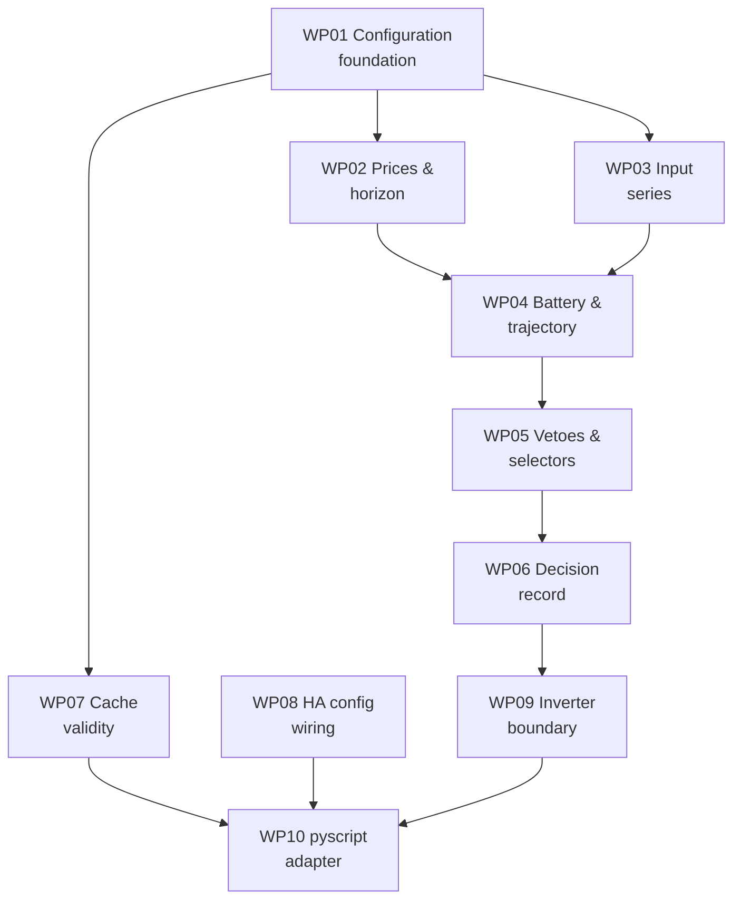

# Tasks: Price-Aware Load Automation

**Mission**: `price-aware-load-automation-01M3PH8Y`
**Branch**: `feat/price-aware-load-automation` | **Merge target**: `feat/price-aware-load-automation`
**Generated**: 2026-09-29
**Inputs**: [spec.md](./spec.md), [plan.md](./plan.md), [research.md](./research.md), [data-model.md](./data-model.md), [contracts/](./contracts/)

67 subtasks across 13 work packages. Subtask completion is **event-sourced** — record it with
`spec-kitty agent tasks mark-status T001 --status done`. The rows below are references, not checkboxes.

## The shape of this mission, in one paragraph

Almost all of the work is a **pure Python core** under `pyscript/modules/` with no Home Assistant
imports, no file I/O and no pyscript decorators — which is what makes it testable with plain
`pytest` and what makes the host choice reversible. WP01–WP07 build that core and its tests.
WP08–WP10 wire it into Home Assistant: the YAML configuration, the inverter boundary that records
intent and transmits nothing, and the thin pyscript adapter that performs every read and write.
Deliberately, no WP mixes pure logic with I/O — that seam is the plan's central decision
(`research.md` R-02) and the work-package boundaries preserve it.

## Subtask Index

*Reference table. The `Parallel` column marks parallel-safety, not status.*

| ID | Description | WP | Parallel |
|----|-------------|----|----------|
| T001 | Create `battery_planner/user_config.example.yaml` with full schema and defaults | WP01 | |
| T002 | Build `config.py`: parse a plain dict into SiteConfig | WP01 | |
| T003 | Add configuration validation with startup-error semantics | WP01 | |
| T004 | Add config fingerprint over block-meaning fields | WP01 | |
| T005 | Create `tests/conftest.py` so tests import from `pyscript/modules/` | WP01 | |
| T006 | Derive consumption and injection prices from market price | WP02 | [P] |
| T007 | Expand a coarse price series onto the block grid, held flat | WP02 | [P] |
| T008 | Determine the rolling horizon end from available price data | WP02 | [P] |
| T009 | Test price derivation, including the negative-injection band | WP02 | [P] |
| T010 | Test horizon determination and flat expansion | WP02 | [P] |
| T011 | Build the solar series from the forecast payload | WP03 | [P] |
| T012 | Implement the zero-solar fallback | WP03 | [P] |
| T013 | Build the usage profile from trailing history | WP03 | [P] |
| T014 | Handle short history with an honest sample count | WP03 | [P] |
| T015 | Test both series, including fallback and short history | WP03 | [P] |
| T016 | Build `battery.py`: BatteryState from capacity and charge percent | WP04 | |
| T017 | Build the trajectory block loop with capacity and power clamps | WP04 | |
| T018 | Detect saturation and quantify spill | WP04 | |
| T019 | Detect reserve breach and compute leftover | WP04 | |
| T020 | Author golden fixtures with known answers | WP04 | |
| T021 | Test the trajectory against the golden fixtures | WP04 | |
| T022 | Implement vetoes V1 and V2 | WP05 | |
| T023 | Implement selectors S1 and S2 | WP05 | |
| T024 | Implement selectors S3 and S4 with bounded windows | WP05 | |
| T025 | Implement selectors S5 and S6 | WP05 | |
| T026 | Implement the resolution loop with veto fall-through | WP05 | |
| T027 | Test every veto, every selector, and the fall-through ordering | WP05 | |
| T028 | Define the DecisionRecord structure | WP06 | |
| T029 | Format a decision as a log line | WP06 | |
| T030 | Render vetoes, degraded markers, and the halt record | WP06 | |
| T031 | Test record formatting and completeness | WP06 | |
| T032 | Define CachedSeries and its serialised shape | WP07 | [P] |
| T033 | Implement the staleness check | WP07 | [P] |
| T034 | Implement fingerprint and day-rollover invalidation | WP07 | [P] |
| T035 | Treat a missing or unreadable cache as a miss | WP07 | [P] |
| T036 | Test staleness, invalidation, and disposability | WP07 | [P] |
| T037 | Add the forecast.solar REST sensor to `configuration.yaml` | WP08 | [P] |
| T038 | Add the pyscript block to `configuration.yaml` | WP08 | [P] |
| T039 | Record how to verify entity names on the live install | WP08 | [P] |
| T040 | Implement `inverter.apply()`: record intent, transmit nothing | WP09 | |
| T041 | Implement `read_charge_percent()` as a visible stub | WP09 | |
| T042 | Make the log append executor-safe | WP09 | |
| T043 | Build the adapter skeleton with a 5-minute trigger | WP10 | |
| T044 | Load the user config file from the adapter | WP10 | |
| T045 | Read prices and forecast from Home Assistant state | WP10 | |
| T046 | Read and write the cache files | WP10 | |
| T047 | Orchestrate the cycle and handle halt plus alerting | WP10 | |
| T048 | Record the quarter-hour semantics question for the detector | WP08 | [P] |
| T049 | Wire the three capacity sensors | WP08 | [P] |
| T050 | Implement veto V3 and the grid-charge cap | WP05 | |
| T051 | Implement selector S0 and its precedence | WP05 | |
| T052 | Render the capacity position in the decision record | WP06 | |
| T053 | Define GridState and build it from meter figures | WP11 | [P] |
| T054 | Compute the peak ceiling | WP11 | [P] |
| T055 | Compute the grid budget | WP11 | [P] |
| T056 | Compute the shave power | WP11 | [P] |
| T057 | Test the capacity model | WP11 | [P] |
| T058 | Build the guard loop skeleton | WP12 | |
| T059 | Read the capacity position | WP12 | |
| T060 | Evaluate S0 and act | WP12 | |
| T061 | Keep the two loops from fighting | WP12 | |
| T062 | Price a peak increase in euros | WP11 | [P] |
| T063 | Write the hardware and prerequisites section | WP13 | |
| T064 | Document the SlimmeLezer firmware configuration | WP13 | |
| T065 | Document the Home Assistant setup and configuration | WP13 | |
| T066 | Document limitations, licensing and contribution | WP13 | |
| T067 | Detect the quarter-hour average's semantics | WP11 | [P] |

---

## Phase 1 — Foundation

### WP01 — Configuration foundation and test scaffolding

**Prompt**: [tasks/WP01-configuration-foundation.md](./tasks/WP01-configuration-foundation.md)
**Priority**: P1 (blocks everything) · **Depends on**: none · **Estimated prompt**: ~330 lines

**Goal**: One hand-edited file holding every value that differs between installations, parsed and
validated by pure code, plus the test scaffolding every later WP relies on.

**Independent test**: `pytest tests/test_config.py` passes; a deliberately invalid config raises at
load rather than producing a plausible-looking decision.

**Subtasks**
T001 Create `battery_planner/user_config.example.yaml` with full schema and defaults (WP01)
T002 Build `config.py`: parse a plain dict into SiteConfig (WP01)
T003 Add configuration validation with startup-error semantics (WP01)
T004 Add config fingerprint over block-meaning fields (WP01)
T005 Create `tests/conftest.py` so tests import from `pyscript/modules/` (WP01)

**Risks**: `config.py` must accept a **dict**, never a path — the file read belongs to the adapter.
Getting this wrong at the first WP would contaminate the seam everything else depends on.

---

## Phase 2 — Core inputs *(WP02, WP03, WP07, WP08 are mutually parallel)*

### WP02 — Price derivation and rolling horizon

**Prompt**: [tasks/WP02-price-derivation.md](./tasks/WP02-price-derivation.md)
**Priority**: P1 · **Depends on**: WP01 · **Estimated prompt**: ~350 lines

**Goal**: Turn the market price series into consumption and injection prices per block, and
establish how far ahead the plan can see.

**Independent test**: `pytest tests/test_prices.py` — including the band where injection is
negative while consumption is still positive.

**Subtasks**
T006 Derive consumption and injection prices from market price (WP02)
T007 Expand a coarse price series onto the block grid, held flat (WP02)
T008 Determine the rolling horizon end from available price data (WP02)
T009 Test price derivation, including the negative-injection band (WP02)
T010 Test horizon determination and flat expansion (WP02)

**Risks**: The two directions use different coefficients and must never share one. The negative
injection offset means injection goes negative while the market price is still positive — the band
that makes V2 load-bearing, and the one live data rarely shows.

---

### WP03 — Solar and usage input series

**Prompt**: [tasks/WP03-input-series.md](./tasks/WP03-input-series.md)
**Priority**: P1 · **Depends on**: WP01 · **Estimated prompt**: ~340 lines

**Goal**: Expected solar production and expected household consumption, per block, across the horizon.

**Independent test**: `pytest tests/test_series.py` — a forecast outage yields zeroes and a marker,
never an exception.

**Subtasks**
T011 Build the solar series from the forecast payload (WP03)
T012 Implement the zero-solar fallback (WP03)
T013 Build the usage profile from trailing history (WP03)
T014 Handle short history with an honest sample count (WP03)
T015 Test both series, including fallback and short history (WP03)

**Risks**: Coarse source data is **held flat, never interpolated** (FR-030) — inventing detail would
make saturation timing look more precise than the forecast supports.

---

### WP11 — Capacity tariff model

**Prompt**: [tasks/WP11-capacity-tariff-model.md](./tasks/WP11-capacity-tariff-model.md)
**Priority**: P1 · **Depends on**: WP01 · **Estimated prompt**: ~340 lines

**Goal**: The arithmetic of the Belgian capaciteitstarief — running average, peak ceiling, grid
budget, and shave power.

**Independent test**: `pytest tests/test_capacity.py` — a hand-computed worked scenario with every
intermediate value asserted.

**Subtasks**
T053 Define GridState and build it from meter figures (WP11)
T054 Compute the peak ceiling (WP11)
T055 Compute the grid budget (WP11)
T056 Compute the shave power (WP11)
T062 Price a peak increase in euros (WP11)
T067 Detect the quarter-hour average's semantics (WP11)
T057 Test the capacity model (WP11)

**Risks**: Window energy already includes household draw — subtracting it again roughly halves the
budget and reads as conservative tuning rather than a bug. The 2.5 kW floor means shaving below it
spends charge for zero saving. Division blows up at both ends of a window.

---

### WP07 — Cache validity logic

**Prompt**: [tasks/WP07-cache-validity.md](./tasks/WP07-cache-validity.md)
**Priority**: P2 · **Depends on**: WP01 · **Estimated prompt**: ~320 lines

**Goal**: Decide when a cached series may be used, purely — so cache correctness is testable.

**Independent test**: `pytest tests/test_cache.py` — a stale series is refused, a fingerprint
mismatch is a miss, and deletion changes no decision.

**Subtasks**
T032 Define CachedSeries and its serialised shape (WP07)
T033 Implement the staleness check (WP07)
T034 Implement fingerprint and day-rollover invalidation (WP07)
T035 Treat a missing or unreadable cache as a miss (WP07)
T036 Test staleness, invalidation, and disposability (WP07)

**Risks**: A file outlives the process, so a series written yesterday is on disk at boot looking
exactly like a fresh one. The timestamp is what makes the cache safe, not an optimisation.

---

### WP08 — Home Assistant configuration wiring

**Prompt**: [tasks/WP08-ha-configuration.md](./tasks/WP08-ha-configuration.md)
**Priority**: P2 · **Depends on**: none · **Estimated prompt**: ~230 lines

**Goal**: Declare the forecast.solar REST sensor and the pyscript block in `configuration.yaml`.

**Independent test**: Home Assistant restarts cleanly; the forecast sensor populates with a
`watt_hours_period` attribute.

**Subtasks**
T037 Add the forecast.solar REST sensor to `configuration.yaml` (WP08)
T038 Add the pyscript block to `configuration.yaml` (WP08)
T039 Record how to verify entity names on the live install (WP08)

**Risks**: C-005 could not be met with the built-in Forecast.Solar integration, which is UI-only —
the REST sensor is the resolution (`research.md` R-03). Roof parameters appear in **two** places
(the REST URL and `user_config.yaml`) and must be kept in step.

---

## Phase 3 — Projection and decision

### WP04 — Battery state and charge trajectory

**Prompt**: [tasks/WP04-charge-trajectory.md](./tasks/WP04-charge-trajectory.md)
**Priority**: P1 · **Depends on**: WP02, WP03 · **Estimated prompt**: ~430 lines

**Goal**: Project charge block by block and surface the three facts a scalar balance cannot — when
the battery fills, how much solar spills after that, and when it would hit the reserve floor.

**Independent test**: `pytest tests/test_trajectory.py` against golden fixtures with hand-computed
saturation block, spill quantity, and breach block.

**Subtasks**
T016 Build `battery.py`: BatteryState from capacity and charge percent (WP04)
T017 Build the trajectory block loop with capacity and power clamps (WP04)
T018 Detect saturation and quantify spill (WP04)
T019 Detect reserve breach and compute leftover (WP04)
T020 Author golden fixtures with known answers (WP04)
T021 Test the trajectory against the golden fixtures (WP04)

**Risks**: **The highest-risk WP in the mission.** Two ceilings bind, not one — capacity *and*
maximum charge power — so spill can begin before saturation. Energy that vanishes in a clamp
instead of being reported as spill makes the planner look better than it is.

---

### WP05 — Vetoes and selectors

**Prompt**: [tasks/WP05-vetoes-and-selectors.md](./tasks/WP05-vetoes-and-selectors.md)
**Priority**: P1 · **Depends on**: WP04 · **Estimated prompt**: ~450 lines

**Goal**: Decide the action, with forbidding rules kept structurally distinct from choosing rules.

**Independent test**: `pytest tests/test_rules.py` — every veto, every selector, and a vetoed
proposal advancing to the *next* selector.

**Subtasks**
T022 Implement vetoes V1 and V2 (WP05)
T023 Implement selectors S1 and S2 (WP05)
T024 Implement selectors S3 and S4 with bounded windows (WP05)
T025 Implement selectors S5 and S6 (WP05)
T026 Implement the resolution loop with veto fall-through (WP05)
T027 Test every veto, every selector, and the fall-through ordering (WP05)

**Risks**: **The fall-through was specified wrongly twice during specify.** A veto removes one
option and advances to the next selector — it never terminates evaluation and never restarts it.
The tests exist to pin that mechanically.

---

### WP06 — Decision record

**Prompt**: [tasks/WP06-decision-record.md](./tasks/WP06-decision-record.md)
**Priority**: P1 · **Depends on**: WP05 · **Estimated prompt**: ~310 lines

**Goal**: One auditable line per cycle that a human can check by hand.

**Independent test**: `pytest tests/test_decision.py` — every field present in every record,
including an explicit "none" where a value does not apply.

**Subtasks**
T028 Define the DecisionRecord structure (WP06)
T029 Format a decision as a log line (WP06)
T030 Render vetoes, degraded markers, and the halt record (WP06)
T031 Test record formatting and completeness (WP06)

**Risks**: This is the mission's **only output surface**. Trimming fields for brevity trades away
the deliverable. A record naming a veto must also name the selector that finally fired.

---

## Phase 4 — Home Assistant integration

### WP09 — Inverter boundary

**Prompt**: [tasks/WP09-inverter-boundary.md](./tasks/WP09-inverter-boundary.md)
**Priority**: P1 · **Depends on**: WP06 · **Estimated prompt**: ~250 lines

**Goal**: Hold everything that will one day speak to the HF2211; for now record intent and send nothing.

**Independent test**: A decision passed to `apply()` appears in the log; no socket is opened and no
frame is built anywhere in the file.

**Subtasks**
T040 Implement `inverter.apply()`: record intent, transmit nothing (WP09)
T041 Implement `read_charge_percent()` as a visible stub (WP09)
T042 Make the log append executor-safe (WP09)

**Risks**: The interface decided here is what the real Modbus implementation must satisfy. It should
express intent — action and target power — not anything transport-shaped. If enabling real control
later requires editing `pyscript/modules/`, the boundary was drawn in the wrong place.

---

### WP10 — pyscript adapter and scheduling

**Prompt**: [tasks/WP10-pyscript-adapter.md](./tasks/WP10-pyscript-adapter.md)
**Priority**: P1 · **Depends on**: WP07, WP08, WP09 · **Estimated prompt**: ~470 lines

**Goal**: The only code that knows Home Assistant exists — trigger every five minutes, read state
and files, call the core, write the outputs.

**Independent test**: Deployed to the NAS, a record appears in `decisions.log` within five minutes
and Home Assistant logs no blocking-I/O warning.

**Subtasks**
T043 Build the adapter skeleton with a 5-minute trigger (WP10)
T044 Load the user config file from the adapter (WP10)
T045 Read prices and forecast from Home Assistant state (WP10)
T046 Read and write the cache files (WP10)
T047 Orchestrate the cycle and handle halt plus alerting (WP10)

**Risks**: Every file operation must run off the event loop with `@pyscript_executor` (or `@pyscript_compile` plus `task.executor`; `@pyscript_compile` alone does NOT move work off the loop) —
a blocking write inside Home Assistant's event loop is a real defect. At 288 cycles a day, alerting
per cycle would send 288 emails. ENTSO-e attribute key names need confirming against the live install.

---

### WP13 — README and open-source packaging

**Prompt**: [tasks/WP13-readme-and-packaging.md](./tasks/WP13-readme-and-packaging.md)
**Priority**: P2 · **Depends on**: WP08, WP10, WP12 · **Estimated prompt**: ~280 lines

**Goal**: A README that lets someone else reproduce this setup — minimum hardware, SlimmeLezer
firmware config, Home Assistant integrations, and the config file — without reading the source.

**Independent test**: Hand it to someone with a similar setup; they can tell within two minutes
whether it applies to them, and follow it end to end without opening another document.

**Subtasks**
T063 Write the hardware and prerequisites section (WP13)
T064 Document the SlimmeLezer firmware configuration (WP13)
T065 Document the Home Assistant setup and configuration (WP13)
T066 Document limitations, licensing and contribution (WP13)

**Risks**: The most damaging possible error is implying the battery is actually controlled — someone
would install it and report working software as broken. The firmware reflash is the step most likely
to be skipped, and without it the capacity half silently cannot work. The licence is the user's
decision, not the implementer's. A secrets scrub must be performed rather than recommended.

---

### WP12 — Peak guard loop

**Prompt**: [tasks/WP12-peak-guard-loop.md](./tasks/WP12-peak-guard-loop.md)
**Priority**: P1 · **Depends on**: WP08, WP09, WP11 · **Estimated prompt**: ~300 lines

**Goal**: A fast, narrow loop that watches the quarter-hour window and calls for discharge before a
capacity peak is set.

**Independent test**: Drive household draw above the ceiling and confirm a discharge is proposed
within 30 seconds; confirm a quiet window produces no log lines at all.

**Subtasks**
T058 Build the guard loop skeleton (WP12)
T059 Read the capacity position (WP12)
T060 Evaluate S0 and act (WP12)
T061 Keep the two loops from fighting (WP12)

**Risks**: Reading per-phase sensors instead of the netted total would shave a phantom peak — on the
observed sample, 0.937 kW against a true 0.003 kW. Logging every 30-second tick would bury the
planner's 288 real decisions under 2,880 empty ones. The guard and the planner both command the
battery and must not fight.

---

## Dependency graph

## Parallel opportunities

- **After WP01**: WP02, WP03 and WP07 run concurrently on separate files with no shared surface.
- **WP08 has no dependencies at all** — it only touches `configuration.yaml` and can start immediately,
  in parallel with WP01.
- **The critical path** is WP01 → WP02/WP03 → WP04 → WP05 → WP06 → WP09 → WP10: seven packages deep.
  WP07 and WP08 are off the critical path and will be waiting well before WP10 needs them.

## MVP scope

**WP01 through WP06** deliver the entire decision engine, fully tested, with no Home Assistant
involvement whatsoever. That is a genuine milestone: at that point every rule in the spec can be
exercised against fixtures, and the negative-price band and midday-saturation cases — the two that
motivated the hardest spec revisions — are verifiable on this Windows machine without a NAS, an
inverter, or a sunny day.

**WP08 through WP10** then make it run for real. WP09 before WP10 is deliberate: the adapter calls
the boundary, so the boundary's shape must settle first.

## Requirement coverage

| WP | Requirements |
|----|-------------|
| WP01 | FR-025 |
| WP02 | FR-001, FR-002, FR-003, FR-030, FR-039 |
| WP03 | FR-004, FR-005, FR-023, FR-030, FR-039, FR-059 |
| WP04 | FR-006, FR-007, FR-008, FR-029, FR-031, FR-032, FR-034, FR-039, FR-040 |
| WP05 | FR-009 – FR-017, FR-040, FR-046, FR-047, FR-048, FR-050 |
| WP06 | FR-018, FR-027, FR-028, FR-052 |
| WP07 | FR-033, FR-035, FR-036, FR-037, FR-038 |
| WP08 | FR-026, FR-042, FR-043 |
| WP09 | FR-019, FR-020 |
| WP10 | FR-021, FR-022, FR-024, FR-034 |
| WP11 | FR-041, FR-044, FR-045, FR-049, FR-053, FR-054, FR-055, FR-057, FR-058 |
| WP12 | FR-051 |
| WP13 | FR-056 |

All 59 functional requirements are mapped.

**Requirements with no tasks, deliberately**: `C-009` (no curtailment control) and `C-010` (single
battery and inverter) are boundary statements, not work. They record what the hardware cannot do and
what the mission excludes; there is nothing to implement for either. Their absence from the table
above is correct, not an oversight.

**Non-functional coverage** is carried in work-package prose rather than in `requirement_refs`,
which tracks functional requirements only: NFR-001 and NFR-009 in WP10 T043, NFR-002 in WP08 T037
and WP10 T045, NFR-003 in WP10 T047, NFR-004 in WP06, NFR-005 in WP09, NFR-006 in WP10 T044,
NFR-007 in WP10 T047, NFR-008 in WP09 T040, NFR-010 in WP12 T058, NFR-011 in WP08 T048 and T049. Because no tool checks these, a reviewer should.
